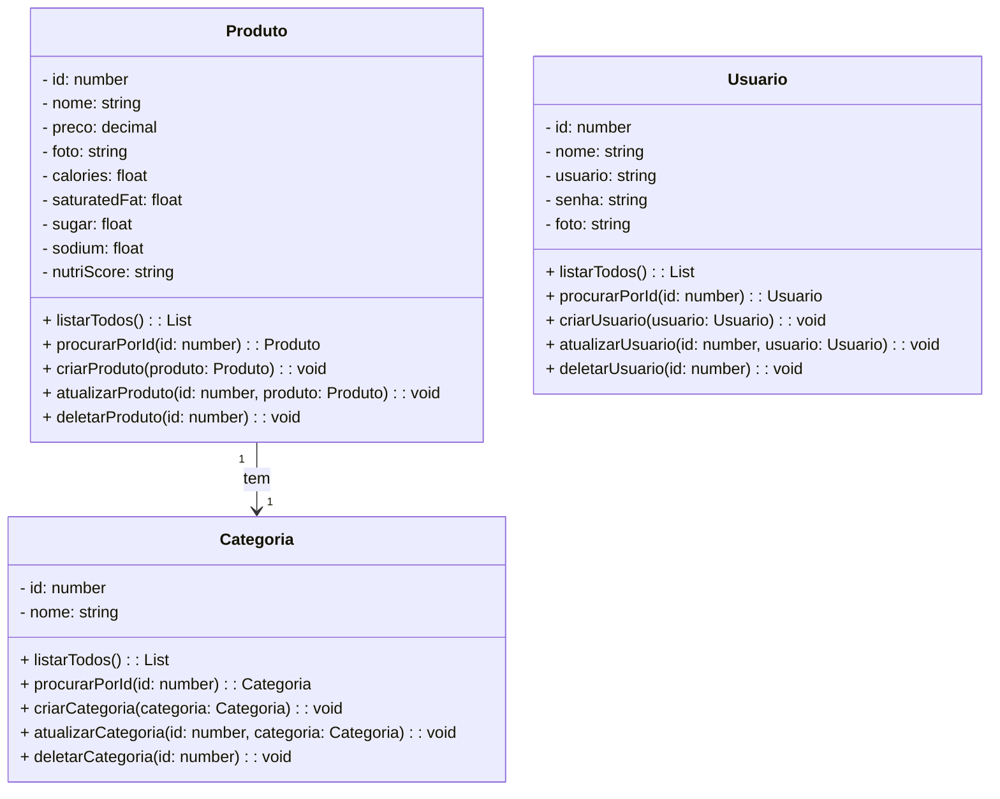

# FastChef - Sistema de Delivery de Alimentos 🍔🍕

## A API FastChef é um sistema para gerenciamento de pedidos de delivery de alimentos, desenvolvido com TypeScript, NestJS e TypeORM. Ela permite o cadastro e gerenciamento de usuários (clientes, entregadores e restaurantes), além de gerenciar o status dos pedidos para garantir uma experiência eficiente para todos os usuários.

## 1. Descrição 📋

Esta API foi criada para atender à necessidade de gerenciamento de pedidos, usuários e entregas de alimentos. Através dela, é possível realizar pedidos de alimentos, gerenciar cardápios de restaurantes, acompanhar o status das entregas em tempo real e garantir que o processo de entrega seja o mais ágil e eficiente possível. Ela foi desenvolvida com boas práticas de programação e arquitetura para garantir que seja escalável, segura e de fácil manutenção.

## 2. Diagrama de Classes 📊

---

## 3. Tecnologias utilizadas

| Item                          | Descrição  |
| ----------------------------- | ---------- |
| **Servidor**                  | Node JS    |
| **Linguagem de programação**  | TypeScript |
| **Framework**                 | Nest JS    |
| **ORM**                       | TypeORM    |
| **Banco de dados Relacional** | MySQL      |

---

## 4. Configuração e Execução

1. Clone o repositório
2. Instale as dependências: `npm install`
3. Configure o banco de dados no arquivo `app.module.ts`
4. Execute a aplicação: `npm run start:dev`

